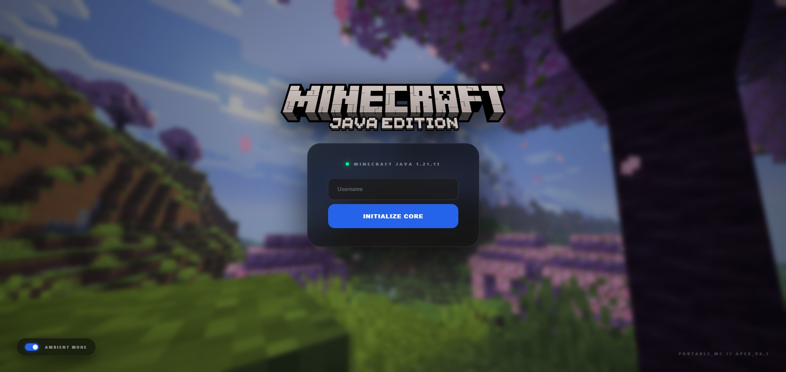

# Minecraft Portable Web Launcher

A Python‑based Minecraft launcher that runs in a browser using [Flask](https://github.com/pallets/flask) and [PortableMC](https://github.com/mindstorm38/portablemc). Designed for restricted Windows environments where arbitrary `.exe` files are blocked. It uses multiple fallback mechanisms (C# compilation, PowerShell, VBScript) to bypass Group Policy restrictions.



## Features

- **Web interface** with live console (via Flask‑SocketIO)
- **CLI mode** for direct terminal launching
- **MSBuild fallback** – compiles a C# loader on‑the‑fly
- **PowerShell & VBScript fallbacks** for the most restricted environments
- **Junctions** for `mods` and `resourcepacks` (or regular directories if junctions are blocked)
- **All data stored in `%LOCALAPPDATA%\PortableMC`** – no clutter in the project folder

## Folder Structure
```text
Minecraft-Portable-Web/
├── main.py # Entry point – menu & bootstrapping
├── portablemc.py # Web server (Flask + SocketIO)
├── Scripts/ # Launcher helper scripts
│ ├── Launcher.targets # MSBuild task
│ ├── PortableMCLoader.cs # C# loader (compiled if needed)
│ ├── Launcher.vbs # VBScript fallback
│ └── Launcher.ps1 # PowerShell fallback
├── static/ # Static assets (logo, ansi_up, socket.io)
├── mods/ (optional) your mods
├── resourcepacks/ (optional) your resource packs
├── options.txt (optional) Minecraft settings
└── servers.dat (optional) server list
```

## Requirements

- Windows 7/8/10/11
- Python 3.11+ (any version) OR the script will download an embedded Python 3.14.
- (Optional) MSBuild (comes with .NET Framework 4.8) – used for the C# fallback.
- (Optional) PowerShell 3.0+ – used as a fallback.
- (Optional) VBScript support – used as a final fallback.

## TL;DR
* Test in **Windows Sandbox**
* Test on a **Restricted Environment** by **Group Policy**
* Sourcery **Security fixes**

## Getting Started

```bash
git clone https://github.com/PythonChicken123/Minecraft-Portable-Web/
cd Minecraft-Portable-Web
git switch scripts
python main.py
```
Then choose a method:
* `1` – Web launcher (opens `portablemc.py` in your browser)
* `2` – MSBuild launcher (uses `Launcher.targets`, compiles C# loader in memory)
* `3` – CLI launcher (runs `portablemc` directly in the terminal)

## How It Works (Bypass Chain)
The launcher tries the most reliable method first, falling back if blocked:

1. **Embedded Python + portablemc** (if the system allows Python execution).
2. **MSBuild + C# compilation** (uses `csc.exe` to compile a tiny loader).
3. **PowerShell** (with `-ExecutionPolicy Bypass`).
4. **VBScript** (via `cscript`).

If all fail, the script reports an error.

All downloaded files (embedded Python, portablemc binary) are stored in `%LOCALAPPDATA%\PortableMC`. Junctions are created for `mods` and `resourcepacks` so that files placed in the project folder appear inside the game.

## Development
* **Linting:** Ruff is used – run `ruff check .` and `ruff format .` before committing.
* **Workflow:** The GitHub Actions workflow (`.github/workflows/main.yml`) automatically applies Ruff fixes on push/pull requests.

## Troubleshooting
* `OSError: [WinError 1260]` – Group policy blocks the method you chose. Try another option.
* **PowerShell / VBScript errors** – Ensure the scripts have proper permissions. The launcher sets `__COMPAT_LAYER=RUNASINVOKER` to avoid UAC prompts.
* **SSL errors** – The C# loader and Python scripts force TLS 1.2 and fall back to disabling certificate validation.
* **Junction creation fails** – The launcher falls back to creating regular directories.

## Found a bug? / Have a suggestion?
If you encounter any issues or have an idea to improve the launcher, please [open an issue](https://github.com/PythonChicken123/Minecraft-Portable-Web/issues) and use the appropriate template. We welcome contributions!

## License
MIT

## Libraries Used
* [PortableMC](https://github.com/mindstorm38/portablemc) – The Heart of The Launcher
* [Flask](https://flask.palletsprojects.com/) & [Flask‑SocketIO](https://flask-socketio.readthedocs.io/) – Web Interface
* [ansi2html](https://github.com/ralphbean/ansi2html) & [ansi_up](https://github.com/drudru/ansi_up) – ANSI colour conversion
* [Socket.io](https://socket.io) - Communication between the web and Flask interfaces
* [Ruff Linter](https://github.com/astral-sh/ruff) - An extremely fast Python linter
